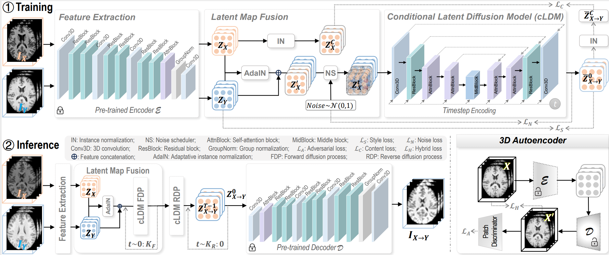

# Unpaired Volumetric Harmonization of Brain MRI with Conditional Latent Diffusion (HCLD)
**Official Repository for the paper: "Unpaired Volumetric Harmonization of Brain MRI with Conditional Latent Diffusion"**

Authors: Mengqi Wu, Minhui Yu, Shuaiming Jing, Pew-Thian Yap, Zhengwu Zhang, Mingxia Liu*

## Train 3D Autoencoder
1. Modify the `data/MRIdata.py` file to configure it with custom MRI datasets.
2. Run `python train_aekl.py` to train the 3D Autoencoder.

## Train the Conditional Latent Diffusion (cLDM) Module
1. Load the checkpoint from the previously trained 3D autoencoder in `train_HCLD.py`.
2. Run `python train_HCLD.py` to train the cLDM.

## Model Inference
1. Load the checkpoint from the previously trained 3D autoencoder in `infer_HCLD_DDIM.py`.
2. Load the checkpoint from the previously trained cLDM in `infer_HCLD_DDIM.py`.
3. Run `python infer_HCLD_DDIM.py` to perform model inference.

## Acknowledgement
Our code was implemented using the [MONAI framework](https://github.com/Project-MONAI/GenerativeModels/tree/main)
